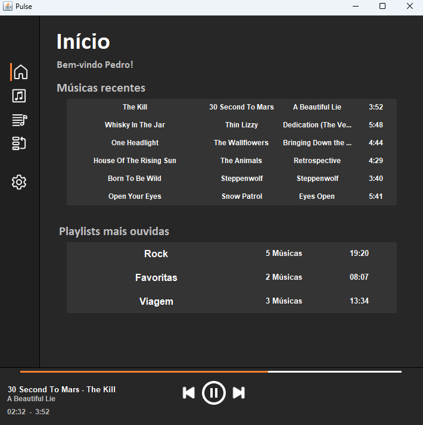

# Pulse




> O Pulse é um reprodutor musical desenvolvido por Pedro Gollo, Bárbara Schneider e Franco Michelon durante a disciplina de Projeto Temático 1, no âmbito do curso de Análise e Desenvolvimento de Sistemas da Universidade de Caxias do Sul. Este aplicativo foi concebido com o objetivo de aplicar os conhecimentos adquiridos ao longo do curso, com ênfase em programação orientada a objetos (POO), fundamentos de banco de dados e princípios fundamentais de engenharia de software. O Pulse oferece aos usuários uma experiência musical completa e prática, sendo uma demonstração da capacidade de desenvolver aplicações funcionais e eficazes usando a linguagem Java e a interface gráfica do Swing.

## 💻 Tecnologias Utilizadas

As tecnologias...


## 💻 Pré-requisitos

Antes de começar, verifique se você atendeu aos seguintes requisitos:

- Você instalou a versão mais recente de `<linguagem / dependência / requeridos>`
- Você tem uma máquina `<Windows / Linux / Mac>`. Indique qual sistema operacional é compatível / não compatível.
- Você leu `<guia / link / documentação_relacionada_ao_projeto>`.

## 🚀 Instalando <nome_do_projeto>

Para instalar o <nome_do_projeto>, siga estas etapas:

Linux e macOS:

```
<comando_de_instalação>
```

Windows:

```
<comando_de_instalação>
```

## ☕ Usando <nome_do_projeto>

Para usar <nome_do_projeto>, siga estas etapas:

```
<exemplo_de_uso>
```

Adicione comandos de execução e exemplos que você acha que os usuários acharão úteis. Fornece uma referência de opções para pontos de bônus!

## 🤝 Colaboradores

Agradecemos às seguintes pessoas que contribuíram para este projeto:

<table>
  <tr>
    <td align="center">
      <a href="#" title="defina o titulo do link">
        <br>
        <sub>
          <b>Iuri Silva</b>
        </sub>
      </a>
    </td>
    <td align="center">
      <a href="#" title="defina o titulo do link">
        <br>
        <sub>
          <b>Mark Zuckerberg</b>
        </sub>
      </a>
    </td>
    <td align="center">
      <a href="#" title="defina o titulo do link">
        <br>
        <sub>
          <b>Steve Jobs</b>
        </sub>
      </a>
    </td>
  </tr>
</table>
